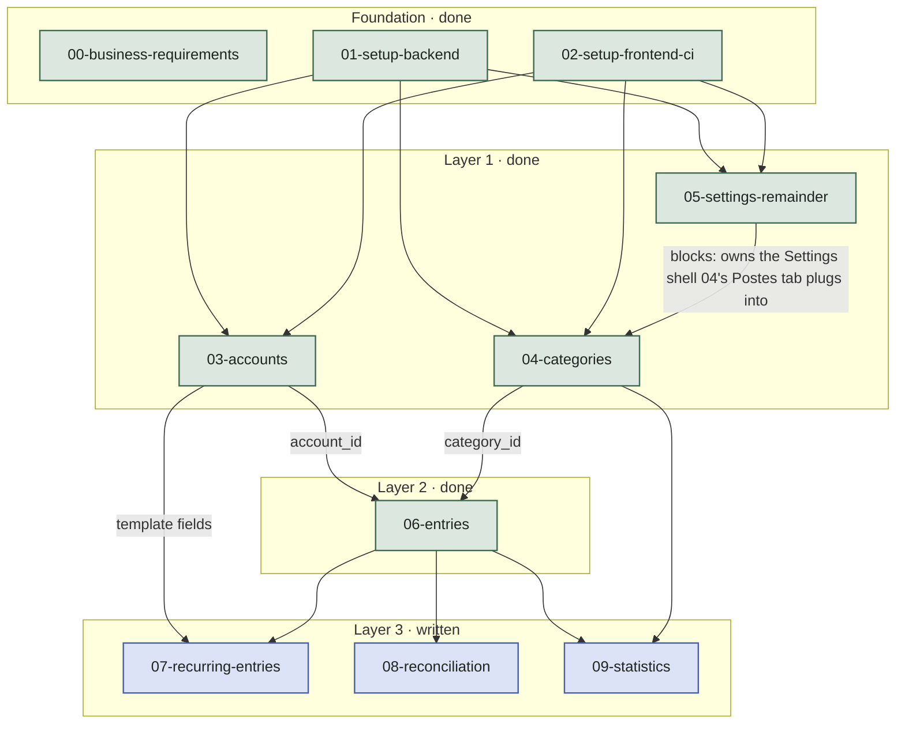

# Spec Dependency Graph

Build order for `docs/spec/`, derived from the data/screen dependencies in `00-business-requirements.md` §§3–4 and cross-checked against `docs/design/design.html` (see the "Cross-checked against the existing prototype" notes in `03`–`05`).

## Reading the graph

- **Foundation** (`00`–`02`) is written and implemented.
- **Layer 1** (`03`–`05`) is written and implemented. `03-accounts` and `05-settings-remainder` are mutually independent; `04-categories` is **blocked by `05-settings-remainder`** — not just informally coordinated — because `05` owns the Settings screen's shell/sub-nav (Postes / Affichage / Stockage) that `04`'s "Postes" tab plugs into. `04` and `05` are declared blocked-by in the issue tracker specifically so `fullstack-agent` never runs them as concurrent features; `03` can run concurrently with either.
- **Layer 2** (`06-entries`) was the pinch point — it needed both `03-accounts` (`account_id`) and `04-categories` (`category_id`) — and is now written and implemented.
- **Layer 3** (`07`–`09`) are the 3 remaining features — now written (`ready-for-agent`), not yet implemented. All depend on `06-entries` existing; `07-recurring-entries` additionally reuses account/entry template fields from `03`, and `09-statistics` additionally needs `04-categories` for its per-category breakdown.

## Settled since the graph was first drawn

- No reconciliation status indicator on the home screen, ever (`03-accounts.md`) — not deferred to `08-reconciliation`.
- Account deletion is UI-reachable only from the archived-accounts view, guarded on "no entries beyond the system entry," behind a named-confirmation dialog (`03-accounts.md`).
- `04-categories` ↔ `05-settings-remainder` has a fixed landing order (`05` first), not a "whichever lands first" coordination note.
- Statistics (`09-statistics.md`) is reached via a "Statistiques" button in the account header, account-scoped — not a persistent sidebar rail item as §4 of the business requirements literally describes. Same kind of prototype-driven correction `04-categories.md` made for "Postes."
